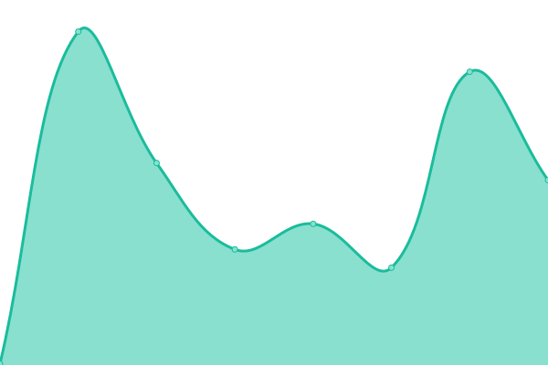
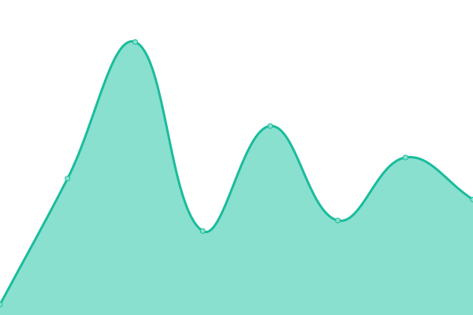
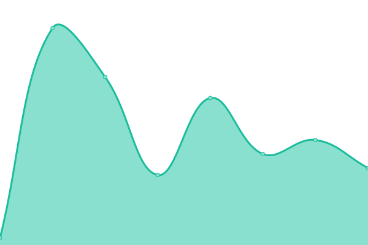

# [📈 Live Status](https://remotecheckin.github.io/monitor): <!--live status--> **🟧 Partial outage**

This repository contains the open-source uptime monitor and status page for [remotecheckin](https://remotecheckin.github.io/monitor), powered by [Upptime](https://github.com/upptime/upptime).

With [Upptime](https://upptime.js.org), you can get your own unlimited and free uptime monitor and status page, powered entirely by a GitHub repository. We use [Issues](https://github.com/remotecheckin/monitor/issues) as incident reports, [Actions](https://github.com/remotecheckin/monitor/actions) as uptime monitors, and [Pages](https://remotecheckin.github.io/monitor) for the status page.

<!--start: status pages-->
<!-- This summary is generated by Upptime (https://github.com/upptime/upptime) -->
<!-- Do not edit this manually, your changes will be overwritten -->
<!-- prettier-ignore -->
| URL | Status | History | Response Time | Uptime |
| --- | ------ | ------- | ------------- | ------ |
|  [Website](https://www.remotecheckin.co.uk) | 🟩 Up | [website.yml](https://github.com/remotecheckin/monitor/commits/HEAD/history/website.yml) | 

 239ms
     
 | 

<a href="https://monitor.remotecheckin.co.uk/history/website">100.00%</a>
    

|  [Test01](https://app.remotecheckin.co.uk/Check_in?SiteID=Test01) | 🟥 Down | [test01.yml](https://github.com/remotecheckin/monitor/commits/HEAD/history/test01.yml) | 

 646ms
     
 | 

<a href="https://monitor.remotecheckin.co.uk/history/test01">0.00%</a>
    

|  [Test02](https://app.remotecheckin.co.uk/Check_in?SiteID=Test02) | 🟥 Down | [test02.yml](https://github.com/remotecheckin/monitor/commits/HEAD/history/test02.yml) | 

 199ms
     
 | 

<a href="https://monitor.remotecheckin.co.uk/history/test02">0.00%</a>
    

|  [FBTest](https://app.remotecheckin.co.uk/Check_in?SiteID=FBTest) | 🟥 Down | [fb-test.yml](https://github.com/remotecheckin/monitor/commits/HEAD/history/fb-test.yml) | 

 163ms
     
 | 

<a href="https://monitor.remotecheckin.co.uk/history/fb-test">0.00%</a>
    

<!--end: status pages-->

[**Visit our status website →**](https://remotecheckin.github.io/monitor)

## 📄 License

- Powered by: [Upptime](https://github.com/upptime/upptime)
- Code: [MIT](./LICENSE) © [remotecheckin](https://remotecheckin.github.io/monitor)
- Data in the `./history` directory: [Open Database License](https://opendatacommons.org/licenses/odbl/1-0/)
